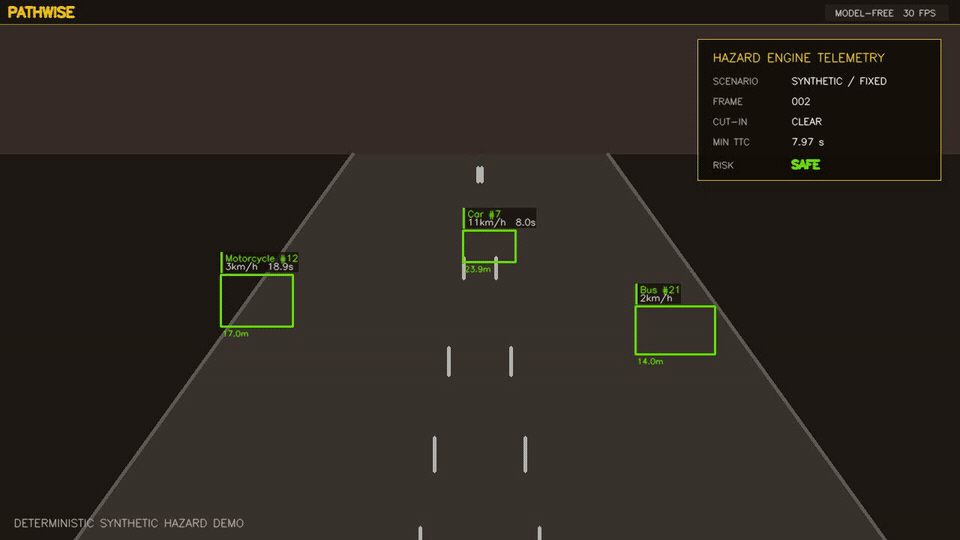
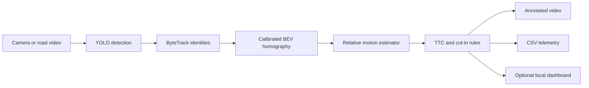
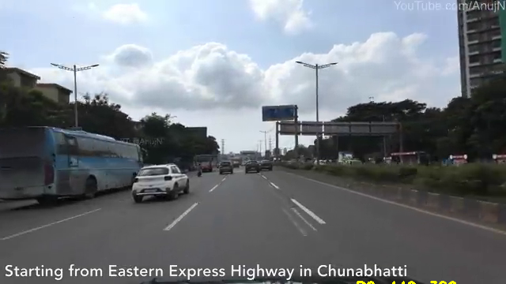

<div align="center">
  <h1>PathWise</h1>
  <p><strong>Explainable road-risk telemetry from tracked camera observations.</strong></p>
  <p>A computer-vision research prototype for detection, tracking, bird's-eye-view projection, relative motion estimation, time-to-collision, and lateral cut-in warnings.</p>

  [](https://github.com/Anantgoel2005/PathWise/actions/workflows/ci.yml)
  [](https://www.python.org/)
  [](LICENSE)
</div>



## What PathWise demonstrates

PathWise connects a YOLO/ByteTrack perception front end to an explicit geometric risk pipeline. The interesting engineering is not another object-detection notebook: it is the stateful workflow around detections, including persistent identities, homography-based road-plane projection, relative velocity, TTC, cut-in logic, overlays, telemetry, and CSV evidence.

| Stage | Responsibility |
| --- | --- |
| Detection and tracking | Ultralytics YOLO with ByteTrack persistent track IDs |
| Road-plane projection | Calibrated homography into a bird's-eye-view coordinate system |
| Motion estimation | Per-track distance buffers and longitudinal/lateral relative velocity |
| Hazard assessment | Transparent TTC thresholds, ego-lane checks, and lateral cut-in rules |
| Presentation | OpenCV annotations plus an optional local Flask/Socket.IO dashboard |
| Evidence | Frame-level CSV telemetry and deterministic scenario metrics |

## Run the safe demo first

The deterministic demo requires no camera, model weights, model download, or network service. It exercises the hazard engine and overlay with three known trajectories: a closing lead car, a motorcycle cutting into the ego lane, and a diverging bus.

```powershell
python -m venv .venv
.\.venv\Scripts\Activate.ps1
python -m pip install -r requirements-test.txt
python demo.py --output output/demo
```

Windows users can run `run_demo.bat` after creating the environment. Outputs are written to `output/demo/`:

- `pathwise-synthetic-demo.mp4` — annotated deterministic scenario
- `telemetry.csv` — actor-level measurements for every frame
- `metrics.json` — duration, actor samples, minimum TTC, cut-in frames, and hazard-level counts

The synthetic demo is a reproducibility fixture, not a claim about detector accuracy.

### Reference scenario output

The committed six-second scenario produces the following deterministic measurements at 30 FPS. The machine-readable record is in [`docs/demo-metrics.json`](docs/demo-metrics.json).

| Measurement | Result |
| --- | ---: |
| Frames | 180 |
| Actor samples | 540 |
| Cut-in frames | 33 |
| Minimum TTC | 2.033 seconds |
| Frames containing a critical actor | 15 |

Hazard-level frame counts can overlap because one frame may contain multiple actors with different risk levels.

## System architecture



Core risk logic is isolated from Ultralytics in `modules/models.py`, `modules/estimator.py`, and `modules/hazard.py`. This keeps deterministic testing lightweight and makes the assumptions reviewable.

## Run the full perception pipeline

Requirements: Python 3.10 or newer, a local road video or webcam, and sufficient disk space for PyTorch and model weights.

```powershell
python -m venv .venv
.\.venv\Scripts\Activate.ps1
python -m pip install -r requirements.txt
python main.py --source C:\path\to\road-video.mp4 --record
```

The default backend is COCO because Ultralytics can obtain the public `yolov10n.pt` weights. The first run may download them. To use a separately obtained India Driving Dataset model:

```powershell
$env:PATHWISE_MODEL_BACKEND = "idd"
$env:PATHWISE_MODEL_PATH = "C:\path\to\idd_model.pt"
python main.py --source C:\path\to\road-video.mp4
```

PathWise does not distribute IDD weights. The tiny file under `data/videos/` is retained only as an input-decoding smoke fixture; it is not long enough to evaluate tracking or hazard quality.

### Optional local dashboard

```powershell
python main.py --source C:\path\to\road-video.mp4 --dashboard --no-display
```

Open `http://127.0.0.1:5000`. The dashboard is disabled by default, binds to loopback, and uses same-origin Socket.IO access. Its current frontend loads visual libraries from CDNs, so the dashboard itself is not an offline artifact.

## Calibration

Edit the road-plane source polygon, BEV destination, and scale in `config.py`. The supplied calibration image is an example rather than a universal camera model.



For meaningful distance and TTC values, calibrate against known lane or road measurements from the target camera. Changing camera height, pitch, crop, resolution, or lens invalidates the previous scale.

## Validation

```powershell
python -m pip install -r requirements-test.txt
python -m pytest
python -m compileall -q main.py demo.py modules utils
python demo.py --frames 120 --no-video --output output/validation
```

GitHub Actions runs the same model-free checks on every pull request. Tests cover TTC thresholds, off-lane suppression, cut-in escalation, critical-event ordering, track velocity history, stale-track pruning, homography behavior, and deterministic demo artifacts.

## Scope and limitations

- TTC is based on relative longitudinal motion under a flat-road homography assumption; it is not depth from a calibrated stereo or LiDAR system.
- Velocity quality depends on detector stability, persistent IDs, frame timing, camera calibration, and ego-motion. The current prototype does not compensate for camera motion.
- Threshold-based cut-in warnings are explainable heuristics, not learned intent prediction.
- No public benchmark accuracy, precision/recall, TTC error, or latency claim is made until evaluated on an appropriate labelled dataset and documented hardware.
- This project is a research and portfolio prototype. It must not be used as a vehicle safety system or as the sole basis for operational decisions.

## Project layout

```text
PathWise/
├── demo.py                 deterministic model-free scenario
├── main.py                 full video/webcam pipeline
├── config.py               model, calibration, and risk thresholds
├── modules/
│   ├── detector.py         YOLO and ByteTrack adapter
│   ├── perspective.py      camera-to-BEV homography
│   ├── estimator.py        track history and relative motion
│   ├── hazard.py           TTC and cut-in assessment
│   ├── overlay.py          annotated-frame rendering
│   ├── web_server.py       optional local dashboard server
│   └── models.py           dependency-light pipeline data models
├── tests/                  deterministic unit and integration tests
└── dashboard/              live telemetry interface
```

## License

PathWise is available under the [MIT License](LICENSE).
